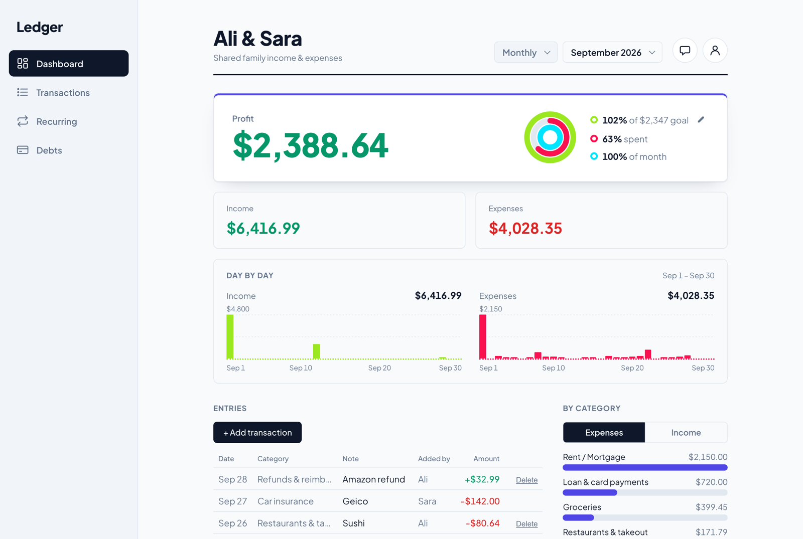
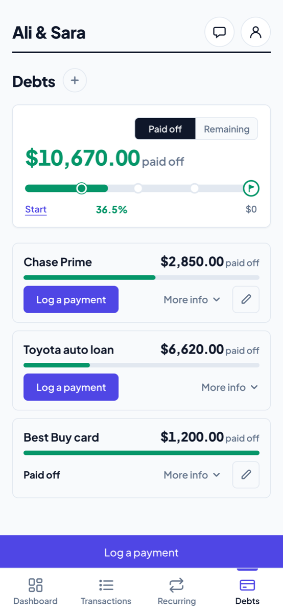
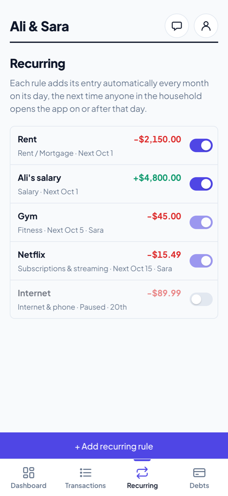
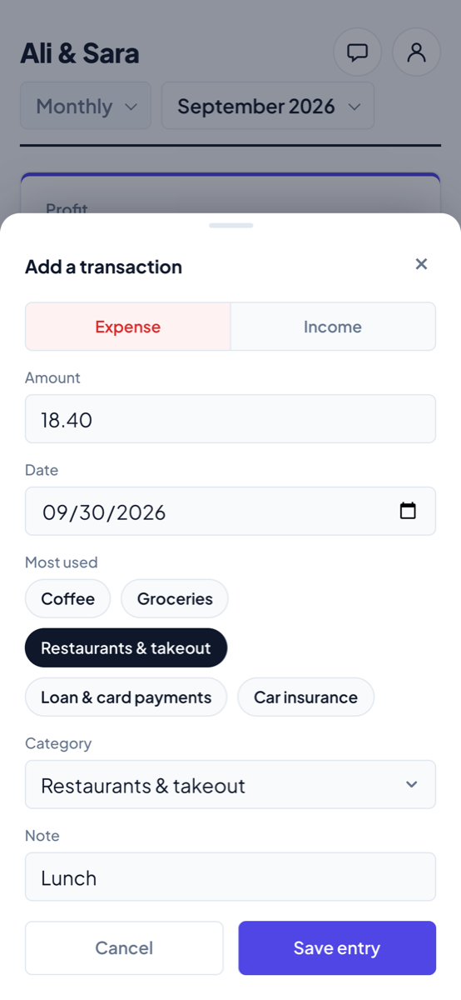
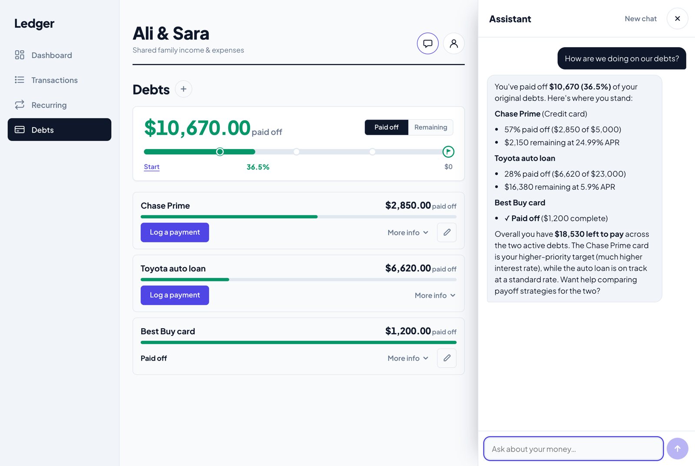

# Ledger

A shared household finance app for two people, with an AI assistant that answers questions from the household's own numbers and a bank import flow that never writes to the ledger without a human's approval.

**Live demo: [ledger-app-mocha-nine.vercel.app](https://ledger-app-mocha-nine.vercel.app)** (sign-up is open; bank connections run against Plaid's Sandbox)

<p>
  
  
</p>

<sub>Screenshots use sample data.</sub>

## What this is

A finance app my partner and I actually use, built for that and not as a tutorial. Two people share one household: they log income and expenses, see the month's profit against a goal, and track paying off credit cards and loans (framed as progress paid off, not as money owed). Rent, salary and subscriptions are recurring rules that add themselves each month. An assistant answers questions like "how are we doing on our debts?" by calling tools over the household's own data. A connected bank account feeds a review queue: every imported transaction waits there until someone approves it, edits its category or skips it.

Also built: email and password sign-up, single-use invite links for a partner, realtime sync between phones, dark mode, and an installable PWA. The UI is designed mobile-first, and every visual rule is written down in [DESIGN.md](DESIGN.md).

<p>
  
</p>
<p>
  
  
  
</p>

<sub>Dashboard; Debts (progress paid off, not money owed); Recurring rules; adding an entry with most-used category chips. Sample household.</sub>

## AI/ML engineering highlights

Everything below is implemented in this repo, and the file links point to it. The assistant is a tool-calling agent, not RAG, and nothing is fine-tuned.

### A hand-built tool-calling agent

[`agent.py`](finance-agent/app/agent.py) implements the agent loop directly on the Anthropic Messages API, without LangChain, LangGraph or another framework. That was deliberate: the aim was to understand and own the mechanism, not configure a framework around it. The loop:

1. Send the conversation, the system prompt and 10 tool schemas to Claude.
2. If the model stops with `tool_use`, run each requested tool in Python, append the results as `tool_result` blocks, and call the model again.
3. Repeat until it answers in plain text, with a hard cap of 6 rounds and a graceful fallback message when the cap is hit.

A tool that raises doesn't crash the request: the error goes back to the model as the tool's result, so it can recover or say what failed. Every call's name, input and output comes back in the API response (`tool_calls`), which is the seed of an evaluation and observability trace. Tool logic lives in [`tools.py`](finance-agent/app/tools.py), separate from the loop, so either can change without the other.

<p>
  
</p>

<sub>A real reply from the configured model (Claude Haiku 4.5), run against the same sample household as the other screenshots. It made one `get_debts` call, and every figure it states ($10,670, 36.5%, $2,850, $6,620) matches the Debts page beside it.</sub>

### Grounded generation: numbers come from code, not from the model

The main hallucination risk in a finance assistant is a confident, wrong number. The design removes arithmetic from the model's job:
- **The prompt rules it out.** The system prompt forbids stating any total, average, trend or percent change that didn't come from a tool call in the conversation, and tells the model not to do arithmetic itself.
- **The tools return finished answers, not raw rows.** They return pre-computed aggregates: sums by period and category, period-over-period deltas, payoff projections month by month at APR/12. `debt_payoff_comparison` even returns explicit `facts` ("higher interest rate: Chase Prime", "smaller balance: Chase Prime"), so the model compares labels rather than working them out.
- **The tools match the UI.** Several reproduce the web app's own formulas line for line, including its rounding: JavaScript-style `Math.round`, and percentages floored the way the Debts page floors them. The assistant can't state a figure the screen contradicts.
- **Today's date is fresh.** The system prompt is built per request with today's date, so date-relative questions don't drift on a long-running server.

**The limit, observed:** this grounds the numbers, not the reasoning over them. In a real run on the sample data, asked "which should we pay off first?", the model quoted every number correctly from `debt_payoff_comparison`. But it labelled the larger debt as the "snowball" option, although the tool's own `facts` said Chase had the smaller balance. The prompt rule is an instruction, not a check: nothing yet verifies a reply against the tool outputs. That's the first item under [What I'd build next](#what-id-build-next).

### Model choice as a cost and capability decision

The agent first shipped on `claude-sonnet-4-6` and now runs on `claude-haiku-4-5-20251001` (the `MODEL` constant in `agent.py`, where the choice is documented). The reasoning, recorded next to it: every number comes from a tool, so the model's job is to choose tools and phrase the answer, which the cheapest tier handles well at lower cost and latency. The strategy-comparison mistake above shows where that tradeoff bites: multi-step reasoning over several tool outputs. An eval set would make this choice measurable instead of judged by hand.

### A human-in-the-loop data pipeline for bank transactions

Plaid imports go through an ingest, normalize, label and review pipeline. Nothing becomes ground truth, a row in `transactions`, without a person approving it.

1. **Ingest:** [`plaid_routes.py`](finance-agent/app/plaid_routes.py) pages through `/transactions/sync` from a stored cursor. On `TRANSACTIONS_SYNC_MUTATION_DURING_PAGINATION` it restarts from the first cursor. Rows are upserted, keyed on household and Plaid transaction id, and the cursor is saved last, so a failed run can simply be repeated.
2. **Normalize:** Plaid's sign (positive means money out) becomes the app's type plus an absolute amount. The merchant falls back to the raw description. Pending transactions are dropped, because Plaid later re-issues them as posted under a new id. The raw Plaid payload is kept on each row (`jsonb`) for lineage and debugging.
3. **Label:** [`plaid_categories.py`](finance-agent/app/plaid_categories.py) suggests a category.
   - It tries Plaid's detailed category, then its primary one, then falls back to `Other`.
   - Money in under a purchase category is treated as a refund.
   - It's a deterministic, rule-based mapper, not a learned model.
4. **Review:** in the app, people approve, change the category, or skip each row. Approving is the only path into the ledger, through a database function (`approve_plaid_imports`). It copies amount, date and type from the queued row, so a reviewer can change only the label. A duplicate is reported and skipped, never inserted twice.

Because the mapper is a pure function and the raw Plaid category is stored on every row, each reviewed row pairs a reproducible prediction with a human label. That's a labelled dataset for evaluating the mapper, collected as a side effect of normal use (not yet used; see below).

### Testing deterministic logic like a data pipeline

The 50 Python tests run without network access, against fakes:
- **Tools** ([`test_tools.py`](finance-agent/tests/test_tools.py), 21 tests) run against an in-memory fake of Supabase's chained query interface. They check sums, deltas, payoff projections and rounding against hand-computed values, and that another household's rows never leak in.
- **Plaid pipeline** ([`test_plaid.py`](finance-agent/tests/test_plaid.py), 21 tests):
  - A mocked Plaid client covers pagination, the restart-on-mutation rule, idempotent re-runs, one failing bank not blocking the others, and pending rows being skipped.
  - Tokens are asserted never to appear unencrypted in a response or the database.
  - One test reads the category list out of the frontend's `src/main.js` and fails if the mapper names a category the app doesn't have: a schema-drift guard across the language boundary.
- **HTTP layer** ([`test_api.py`](finance-agent/tests/test_api.py), 8 tests): routes, the allowlist, size caps.

## Other engineering decisions

**Row-level security is the authorization boundary, not application code.** Postgres policies scope every table (`households`, `household_members`, `transactions`, `debts`, `recurring_rules`, the Plaid tables) to the households the signed-in user belongs to, and only an entry's author can delete it. Column grants stop the browser from setting fields only the server should write. Multi-step writes are `security definer` functions that check membership themselves and run as one transaction. The Python backend never uses a service-role key: it verifies the caller's Supabase JWT, then queries through a client scoped to that same JWT, so the agent's tools and the Plaid endpoints see exactly what the user could see in the browser, no more.

**Plaid access tokens are treated as live bank credentials.** They're encrypted with Fernet ([`token_crypto.py`](finance-agent/app/token_crypto.py)) before they reach the database, and decrypted only in memory, just before a Plaid call. They're never logged or returned. If saving a new connection fails, the item is removed at Plaid. The client refuses any environment but Sandbox.

**Costs and abuse are closed by default.** Sign-up is open, so the assistant answers only emails in `ASSISTANT_ALLOWED_EMAILS` (an unset list lets nobody in), and requests have size caps. The API is same-origin, so it needs no CORS.

## Tech stack

- **Frontend:** Vite + vanilla JavaScript (no framework), installable as a PWA
- **Data and auth:** Supabase: Postgres, Auth, Realtime and row-level security
- **Backend:** FastAPI (Python), deployed as a Vercel Python function in the same project
- **AI:** Anthropic's Claude API with tool use (Claude Haiku 4.5)
- **Bank data:** Plaid (Transactions, via `/transactions/sync`)

## Architecture

```
Browser (Vite build, PWA)
  │
  ├── static app ─────────────── Vercel (dist/)
  │
  ├── supabase-js ────────────── Supabase: Postgres + RLS, Auth, Realtime
  │                               (reads, simple writes, and the security-definer
  │                                functions for multi-step writes)
  │
  └── POST /api/* (same origin) ─ Vercel Python function (api/index.py → FastAPI)
        │  body carries the user's Supabase JWT; verified with Supabase Auth
        │
        ├── Supabase, as that user (JWT-scoped client, RLS applies; no service key)
        ├── /api/chat        → Anthropic Claude ⇄ tools.py (all arithmetic in Python)
        └── /api/plaid/*     → Plaid Sandbox (link-token, exchange, sync)
                                 └→ plaid_review_queue → human review → transactions
```

## Running it yourself

**Supabase**
1. Create a project and run all of [`supabase/schema.sql`](supabase/schema.sql) in the SQL editor. An existing project runs only the dated `MIGRATION` blocks it hasn't had yet. Each one is safe to re-run.
2. In Authentication, turn on **Confirm email**, set a minimum password length of 8, and add your site URL plus `http://localhost:5173/**` to the redirect URLs. Invite and reset emails need the `/**`. For real use, connect your own SMTP server: Supabase's built-in sender is rate-limited.

**Web app**

```bash
cp .env.example .env        # VITE_SUPABASE_URL, VITE_SUPABASE_ANON_KEY (public by design; RLS protects the data)
npm install
npm run dev                 # http://localhost:5173
```

**Assistant and bank API (optional locally)**

```bash
cd finance-agent
python3 -m venv .venv && source .venv/bin/activate
pip install -r requirements-dev.txt
cp .env.example .env        # ANTHROPIC_API_KEY, ASSISTANT_ALLOWED_EMAILS, PLAID_* (see the file)
pytest tests/               # 50 tests, no network
uvicorn app.main:app --port 8000
```

Vite proxies `/api` to port 8000, so the app talks to the backend on its own origin, just as it does in production. `API_TARGET=https://<deployment> npm run dev` points the proxy at a deployment instead.

**Deploy (Vercel)**

Import the repo. `vercel.json` already routes `/api/*` to the Python function and everything else to the app. Add these environment variables:
- `VITE_SUPABASE_URL` and `VITE_SUPABASE_ANON_KEY`.
- `ANTHROPIC_API_KEY` and `ASSISTANT_ALLOWED_EMAILS`, for the assistant.
- `PLAID_ENV=sandbox`, `PLAID_CLIENT_ID`, `PLAID_SECRET_SANDBOX` and `PLAID_TOKEN_ENCRYPTION_KEY`, for bank connections.

Server-only keys never get a `VITE_` prefix. `/api/health` reports `assistant_ready` and `plaid_ready`, never the values. Vercel builds Python functions on its newest Python (3.14) with prebuilt wheels only, so check pins as described at the top of [`requirements.txt`](requirements.txt).

Add your own `public/icon-192.png` and `public/icon-512.png` before installing it on a phone ("Add to Home Screen").

More detail: [finance-agent/README.md](finance-agent/README.md) covers the agent and the Plaid endpoints, and [DESIGN.md](DESIGN.md) covers the design system.

## What I'd build next

- **An eval harness for the agent.** Planned, not built. It would hold a golden set of household questions over fixed sample data, each with the expected tool calls and the facts a correct answer must contain. It would score tool selection and answer accuracy on every prompt or model change, and turn the Sonnet-to-Haiku choice into a measured tradeoff. The snowball mislabel above is its first test case.
- **An automated grounding check.** Parse every number in a reply and require that it appears in (or follows directly from) that turn's tool outputs, flagging any that don't. It's cheap, deterministic, and would turn the prompt's "no numbers without a tool" rule into something actually verified.
- **Validate the category mapper against labels, then consider learning it.** The mapper is heuristic today: a hand-written table plus rules, never measured against real outcomes. Reviewed queue rows already pair Plaid's category with the category a person approved. The next step is a held-out accuracy report per Plaid category. A learned model would only be worth it if it beats the rules on that report, for example one using merchant names as well.
- **Persist the traces.** Tool-call traces are returned per request and then discarded. Storing them, alongside the question and whether the user asked a follow-up, would give real usage data for the eval set.
- **Detect transfers and card payments.** With a checking account and a credit card both linked, paying the card shows up on both sides. Today someone has to notice and skip it; the raw Plaid data needed to pair them is already stored.
- **Close the Plaid gaps before Production.** There are no webhooks yet: sync runs at connect time and on "Sync now". There's no re-login flow for `ITEM_LOGIN_REQUIRED`, no allowlist on the Plaid endpoints, and no key rotation: a single Fernet key would need to become `MultiFernet`.
- **Add frontend tests and scheduled recurring entries.** The UI has no committed test suite; it was checked with scripts outside the repo, and a few Playwright flows would catch regressions. Recurring entries are created only when someone opens the app; a `pg_cron` job would make them run on schedule.
