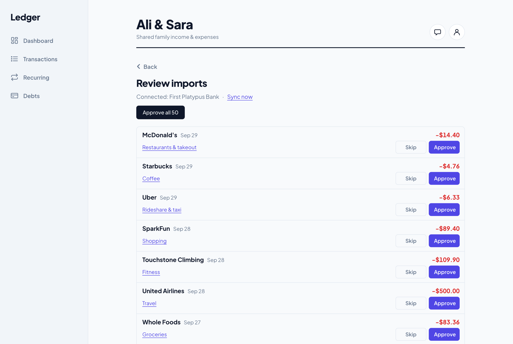
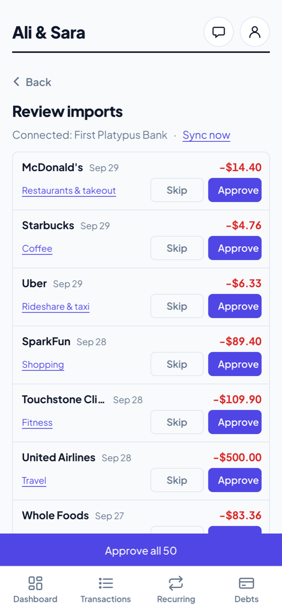

# Ledger

A shared household finance app for two people, with an AI assistant that answers questions from the household's own numbers and a bank import flow that never writes to the ledger without a human's approval.

**Live demo: [ledger-app-mocha-nine.vercel.app](https://ledger-app-mocha-nine.vercel.app)** (sign-up is open; bank connections run against Plaid's Sandbox)

<p>
  
  
</p>

<sub>Screenshots use sample data.</sub>

## What this is

A finance app my partner and I actually use, built for that and not as a tutorial. Two people share one household: they log income and expenses, see the month's profit against a goal, and track paying off credit cards and loans (framed as progress paid off, not as money owed). Rent, salary and subscriptions are recurring rules that add themselves each month. An assistant answers questions like "which card should we pay off first?" by calling tools over the household's own data. A connected bank account feeds a review queue: every imported transaction waits there until someone approves it, edits its category or skips it.

Also built: email and password sign-up, single-use invite links for a partner, realtime sync between phones, dark mode, and an installable PWA. The UI is designed mobile-first, and every visual rule is written down in [DESIGN.md](DESIGN.md).

## Notable technical decisions

**The model never does the maths.** The assistant ([finance-agent/](finance-agent/)) is a hand-written tool-calling loop around Claude, with no agent framework: at most 6 rounds of "model asks for a tool, Python runs it, the result goes back". Its 10 tools ([app/tools.py](finance-agent/app/tools.py)) cover spending summaries and comparisons, recurring-charge detection, debts with payoff projections, and the profit goal. The system prompt forbids stating any number that didn't come from a tool call in the conversation. Several tools mirror the web app's own calculations line for line (the debt percentages, the Debts page's payoff estimate, the Dashboard's automatic goal), so the assistant and the UI can't disagree. [tests/test_tools.py](finance-agent/tests/test_tools.py) holds 21 tests on those tools against an in-memory fake Supabase, with no network. They pin the sums, the rounding, household isolation, and edge cases like a minimum payment that never covers the interest. The prompt also carries the Debts page's tone rules: lead with progress, and raise concern only for a real problem the numbers show.

**Row-level security is the authorization boundary, not application code.** Postgres policies scope every table (`households`, `household_members`, `transactions`, `debts`, `recurring_rules`, the Plaid tables) to the households the signed-in user belongs to, and only an entry's author can delete it. Column grants stop the browser from setting fields only the server should write (which rule or debt created an entry, or a bank transaction's id). Multi-step writes are `security definer` functions that check membership themselves and run as one transaction: logging a debt payment, creating recurring entries, redeeming an invite. The Python backend never uses a service-role key. It verifies the caller's Supabase JWT with Supabase Auth, then queries through a client scoped to that same JWT, so the assistant and the Plaid endpoints can see exactly what the user could see in the browser, no more. Invite links store only a SHA-256 hash of their token, and expire after 7 days or one use.

**Plaid access tokens are treated as live bank credentials.** They're encrypted with Fernet ([app/token_crypto.py](finance-agent/app/token_crypto.py)) before they reach the database, and decrypted only in memory, just before a Plaid call. They're never logged or returned in a response. If saving a new connection fails, the item is removed at Plaid, so no connection is left that nothing here knows about. The Plaid client refuses any environment but Sandbox until Production has had its own review.

**No silent imports.** Syncing never writes to the ledger. `/transactions/sync` pages into `plaid_review_queue`, together with the raw Plaid payload for debugging, and nothing reaches `transactions` until a person approves it. The one write path that needs more trust than the browser has is a database function, `approve_plaid_imports()`. It copies amount, date and type from the queued row (the caller can only change the category), inserts the entry and marks the row reviewed in one transaction. A unique `plaid_transaction_id` turns a double approve, or two partners approving at once, into a reported `duplicate` rather than a second entry. The sync is idempotent: the cursor is saved last, rows are upserted, and pending transactions are skipped because Plaid later re-issues them as posted under a new id. So a failed run simply repeats.

**Costs and abuse are closed by default.** Sign-up is open, so the assistant answers only emails in `ASSISTANT_ALLOWED_EMAILS` (an unset list lets nobody in), and requests have size caps. The API is same-origin, so it needs no CORS at all.

## Tech stack

- **Frontend:** Vite + vanilla JavaScript (no framework), installable as a PWA
- **Data and auth:** Supabase: Postgres, Auth, Realtime and row-level security
- **Backend:** FastAPI (Python), deployed as a Vercel Python function in the same project
- **AI:** Anthropic's Claude API with tool use (Claude Haiku 4.5)
- **Bank data:** Plaid (Transactions, via `/transactions/sync`)

## Architecture

```
Browser (Vite build, PWA)
  │
  ├── static app ─────────────── Vercel (dist/)
  │
  ├── supabase-js ────────────── Supabase: Postgres + RLS, Auth, Realtime
  │                               (reads, simple writes, and the security-definer
  │                                functions for multi-step writes)
  │
  └── POST /api/* (same origin) ─ Vercel Python function (api/index.py → FastAPI)
        │  body carries the user's Supabase JWT; verified with Supabase Auth
        │
        ├── Supabase, as that user (JWT-scoped client, RLS applies; no service key)
        ├── /api/chat        → Anthropic Claude ⇄ tools.py (all arithmetic in Python)
        └── /api/plaid/*     → Plaid Sandbox (link-token, exchange, sync)
                                 └→ plaid_review_queue → human review → transactions
```

## Running it yourself

**Supabase**
1. Create a project and run all of [`supabase/schema.sql`](supabase/schema.sql) in the SQL editor. An existing project runs only the dated `MIGRATION` blocks it hasn't had yet. Each one is safe to re-run.
2. In Authentication, turn on **Confirm email**, set a minimum password length of 8, and add your site URL plus `http://localhost:5173/**` to the redirect URLs. Invite and reset emails need the `/**`. For real use, connect your own SMTP server: Supabase's built-in sender is rate-limited.

**Web app**

```bash
cp .env.example .env        # VITE_SUPABASE_URL, VITE_SUPABASE_ANON_KEY (public by design; RLS protects the data)
npm install
npm run dev                 # http://localhost:5173
```

**Assistant and bank API (optional locally)**

```bash
cd finance-agent
python3 -m venv .venv && source .venv/bin/activate
pip install -r requirements-dev.txt
cp .env.example .env        # ANTHROPIC_API_KEY, ASSISTANT_ALLOWED_EMAILS, PLAID_* (see the file)
pytest tests/               # 50 tests, no network
uvicorn app.main:app --port 8000
```

Vite proxies `/api` to port 8000, so the app talks to the backend on its own origin, just as it does in production. `API_TARGET=https://<deployment> npm run dev` points the proxy at a deployment instead.

**Deploy (Vercel)**

Import the repo. `vercel.json` already routes `/api/*` to the Python function and everything else to the app. Add these environment variables:
- `VITE_SUPABASE_URL` and `VITE_SUPABASE_ANON_KEY`.
- `ANTHROPIC_API_KEY` and `ASSISTANT_ALLOWED_EMAILS`, for the assistant.
- `PLAID_ENV=sandbox`, `PLAID_CLIENT_ID`, `PLAID_SECRET_SANDBOX` and `PLAID_TOKEN_ENCRYPTION_KEY`, for bank connections.

Server-only keys never get a `VITE_` prefix. `/api/health` reports `assistant_ready` and `plaid_ready`, never the values. Vercel builds Python functions on its newest Python (3.14) with prebuilt wheels only, so check pins as described at the top of [`requirements.txt`](requirements.txt).

Add your own `public/icon-192.png` and `public/icon-512.png` before installing it on a phone ("Add to Home Screen").

More detail: [finance-agent/README.md](finance-agent/README.md) covers the agent and the Plaid endpoints, and [DESIGN.md](DESIGN.md) covers the design system.

## What I'd do differently / next

- **Evaluate the model, not just the tools.** The tests prove the tools' arithmetic, not that the model picks the right tool, reads the right date range, or keeps to the tone rules. The next step is a small eval set of household questions with expected tool calls and facts, scored on every prompt or model change. The move to a cheaper model was checked by hand, not measured.
- **Build an eval set for the category mapping.** Mapping Plaid categories to ours ([plaid_categories.py](finance-agent/app/plaid_categories.py)) is a hand-written table plus heuristics, such as treating money in under a purchase category as a refund. The review queue already produces labels for free: the suggested category next to the one a person approved. Scoring the mapping against those would show where it's wrong.
- **Detect transfers and card payments.** With a checking account and a credit card both linked, paying the card shows up on both sides. Today someone has to notice and skip it. The raw Plaid data needed to pair these automatically is already stored.
- **Close the Plaid gaps before Production.**
  - No webhooks: sync runs when a bank is connected and when someone taps Sync now.
  - No re-login flow when a bank needs its login again (`ITEM_LOGIN_REQUIRED` is reported, not fixed).
  - No allowlist on the Plaid endpoints, which Production pricing would need.
  - No key rotation: a single Fernet key would need to become `MultiFernet`.
- **Add frontend tests.** The UI is one large vanilla JS module with no test suite in the repo. It was checked with a fetch stub and headless Chrome scripts that live outside it. A few committed Playwright flows would catch regressions, for example sign-in, adding an entry, and approving an import.
- **Run recurring rules on a schedule.** Entries are created when someone opens the app, so an unopened month lags. A `pg_cron` job calling the existing `materialize_recurring()` would fix it.
